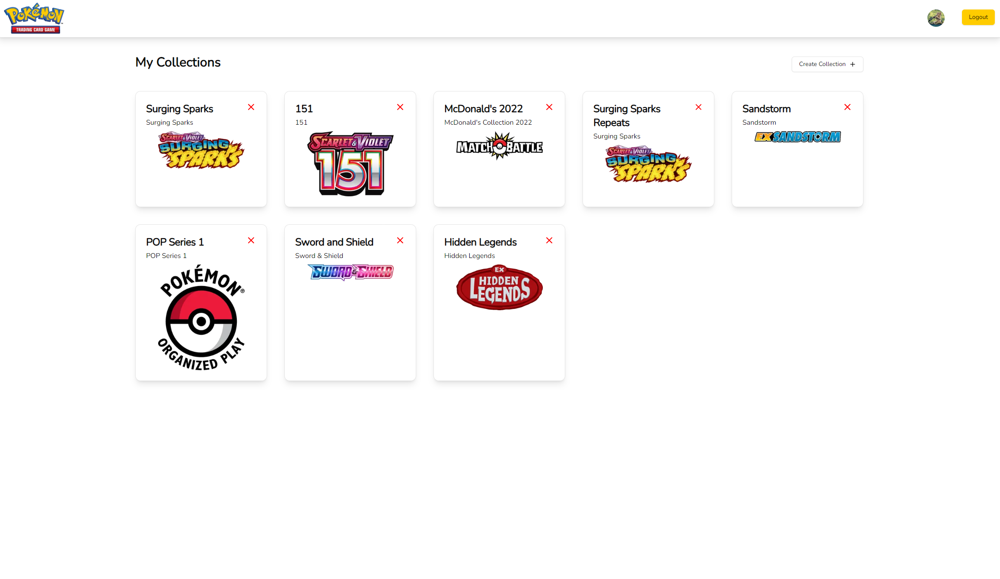
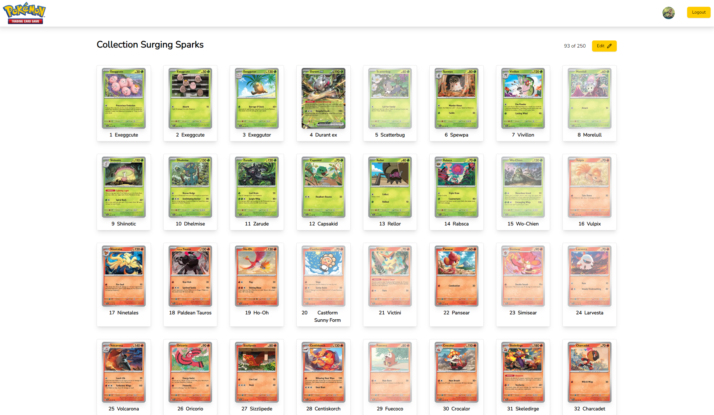

# Pokémon TCG

## Table of Contents

- [Overview](#overview)
- [Features](#features)
- [Technologies](#technologies)
- [Getting Started](#getting-started)
  - [Prerequisites](#prerequisites)
  - [Installation](#installation)
  - [Environment Variables](#environment-variables)
- [Running the Application](#running-the-application)
- [WebSite Preview](#website-preview)
- [Test Yourself](#test-yourself)

## Overview

This frontend is built using **Next.js** with **TypeScript** for creating a performant and scalable web application. **Tailwind CSS** is used for styling, and **shadcn/ui** provides accessible and customizable UI components. **Axios** is integrated for API requests, making data fetching seamless and efficient. <br>
**WARNING: This app is not otimized to mobile devices yet!!**

## Features

- Modern and clean Ui design.
- Fully responsive layout.
- API integration using Axios.
- Reusable and accessible components with shadcn.
- Tailwind CSS for rapid styling and responsiveness.

---

## Technologies

- [Next.js](https://nextjs.org/)
- [TypeScript](https://www.typescriptlang.org/)
- [Tailwind CSS](https://www.prisma.io/)
- [Axios](https://axios-http.com/)

## Getting Started

### Prerequisites

Ensure you have the following installed:

- [Node.js](https://nodejs.org/) (>= 16.x)
- [npm](https://www.npmjs.com/) (or [yarn](https://yarnpkg.com/))

### Installation

1. Clone the repository:

   ```bash
   git clone https://github.com/falcao11/pokemon-tcg-frontend.git
   cd pokemon-tcg-frontend
   ```

2. Install dependencies:
   ```bash
   npm install
   # or
   yarn install
   ```

### Environment Variables

Create a `.env` file in the root directory and add the following variables.

```bash
NEXT_PUBLIC_API_URL="http://localhost:3333/api/v1"
```

## Running the Application

1. Run the application:

   ```bash
   npm run dev
   # or
   yarn dev
   ```

2. Open your browser and visit:
   ```bash
   http://localhost:3000
   ```

## Website Preview

1. My Collections<br><br>
   </img>

2. My Cards by Collection<br><br>
   </img>

## Test Yourself

[You can try it there if you want!](https://pokemontcg-two.vercel.app/)
